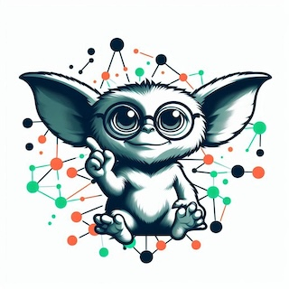

## Bremlin Parser

```
Command:
Start[iri]
.Or(
        HasType[Gremlin]
        .HasType[GooGrok]
)
.HasValue[FurColor, "green", "blue"]
.And(
        InScheme[<http://example.org/Animals>]
        .HasBroader[<http://example.org/Fantasy>, <http://example.org/Preditor>]
)
.Follow[SmellOfFood]
.HasType[TastyMeal]
.Eval

Step Chain:
[]parser.Step{
  parser.Step{
    token:  2,
    arg:    "iri",
    vals:   []string(nil),
    subcmd: []parser.Step(nil),
  },
  parser.Step{
    token:  14,
    arg:    "",
    vals:   []string(nil),
    subcmd: []parser.Step{
      parser.Step{
        token:  4,
        arg:    "Gremlin",
        vals:   []string(nil),
        subcmd: []parser.Step(nil),
      },
      parser.Step{
        token:  4,
        arg:    "GooGrok",
        vals:   []string(nil),
        subcmd: []parser.Step(nil),
      },
    },
  },
  parser.Step{
    token: 6,
    arg:   "FurColor",
    vals:  []string{
      "green",
      "blue",
    },
    subcmd: []parser.Step(nil),
  },
  parser.Step{
    token:  7,
    arg:    "ex:Animals",
    vals:   []string(nil),
    subcmd: []parser.Step(nil),
  },
  parser.Step{
    token: 8,
    arg:   "ex:Fantasy",
    vals:  []string{
      "ex:Preditor",
    },
    subcmd: []parser.Step(nil),
  },
  parser.Step{
    token:  10,
    arg:    "SmellOfFood",
    vals:   []string(nil),
    subcmd: []parser.Step(nil),
  },
  parser.Step{
    token:  4,
    arg:    "TastyMeal",
    vals:   []string(nil),
    subcmd: []parser.Step(nil),
  },
  parser.Step{
    token:  3,
    arg:    "",
    vals:   []string(nil),
    subcmd: []parser.Step(nil),
  },
}
```